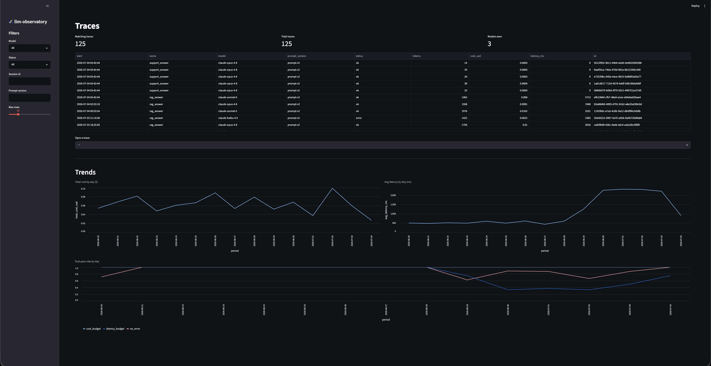

# llm-observatory 🛰️

[](https://github.com/himanshutamboli/llm-observatory/actions/workflows/ci.yml)
[](https://www.python.org/)
[](https://github.com/astral-sh/ruff)
[](docs/architecture.md)

> An **LLM observability & evaluation platform**: capture every LLM call as a trace, score it
> (offline on datasets + online on live traffic), **detect quality regressions** across
> prompt/model versions, and see it all in a dashboard with alerting. *Datadog + a test suite,
> for LLM apps.*

## Demo



*One command populates a full scenario; the dashboard shows it. In the recent window latency
spikes and eval pass-rate drops — a **real regression** (prompt-v2 degraded), which regression
detection and alerting both catch.*

```bash
uv sync --dev
uv run alembic upgrade head                  # create the schema
uv run python -m llm_observatory.demo        # populate history + a regression + live traffic
uv run streamlit run app.py                  # explore: traces → detail → trends
```

Recording walkthrough: [`docs/demo_script.md`](docs/demo_script.md).

## Why this exists

LLM apps fail silently. A prompt tweak or model upgrade can quietly degrade answer quality,
inflate cost, or add latency — and teams find out from users, not dashboards. Traditional APM
captures latency and errors but not *quality*. This platform makes trace capture, evaluation,
and **regression detection** first-class, so a bad change is caught by a chart and an alert
instead of a support ticket.

## Architecture

```
 instrumented app → SDK (trace/span) → Writer → storage (traces · spans · eval_scores)
                                                    │  SQLite (dev) / Postgres (prod)
                    ┌───────────────────────────────┼───────────────────────────┐
                    ▼                                ▼                           ▼
              query layer                offline + online eval           regression
              (list/filter)              (datasets & live traffic)       (version deltas)
                    └──────────────► dashboard (traces/detail/trends) + alerting ◄────┘
```

Full component walkthrough, data model, and design decisions: **[`docs/architecture.md`](docs/architecture.md)**
· PRD: [`docs/design.md`](docs/design.md).

## What it does

- **Instrumentation SDK** — `trace`/`span` context managers + an `@observe` decorator capture
  input/output, latency, tokens, and cost (derived from a model price table). Capture is
  decoupled from storage via a `Writer` seam.
- **Storage + query** — SQLAlchemy 2.0 models (portable SQLite→Postgres) with Alembic
  migrations *validated in CI*; a query layer to filter/paginate traces and fetch a trace tree.
- **Offline eval** — run a target over a **versioned dataset**, score with pluggable evaluators,
  persist results tagged `dataset_id` / `run_id` / `config_version`.
- **Online eval** — deterministically sample live traces and score them off the hot path with
  label-free evaluators (no-error, latency/cost budgets).
- **Regression detection** — compare score distributions (mean / p50 / p95 / pass-rate) across
  versions and flag drops beyond a threshold.
- **Dashboard** — Streamlit: trace list with filters, deep-linkable trace detail (span tree +
  scores), and trends over time.
- **Alerting** — threshold rules over a rolling window → pluggable notifier (logging,
  Slack/webhook, memory).

## Design highlights

- Portable column types (string UUIDs, generic JSON) — the SQLite→Postgres path is real.
- Migrations tested (`upgrade`/`downgrade`) in CI, so a broken migration fails the pipeline.
- Versioned eval configs make runs comparable → regression detection is a `GROUP BY` away.
- Deterministic id-hash online sampling → reproducible, idempotent (dedup by trace+evaluator).
- Regression flags on mean *or* pass-rate drop; stdlib-only stats, no scipy.
- Every layer tested (41 tests); the whole engine runs from one demo command.

## Tech

Python 3.13 · SQLAlchemy 2.0 + Alembic · Streamlit · `uv` · `ruff` · `pytest` · GitHub Actions.

## Cross-link

On **Day 40** of the portfolio, the `agentic-workflow` flagship is instrumented *by this
platform* — every agent run traced and scored here. That mutual citation is the strongest
signal across the repos.

## License

MIT
